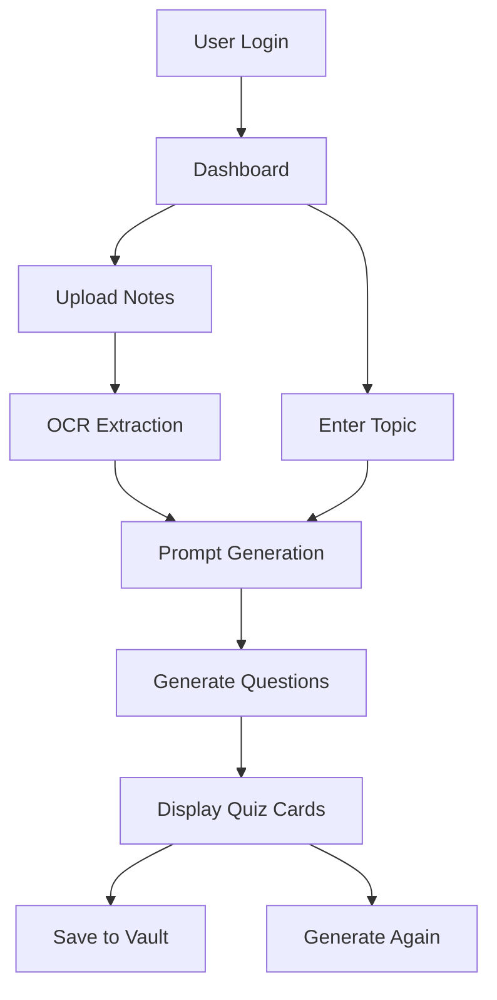
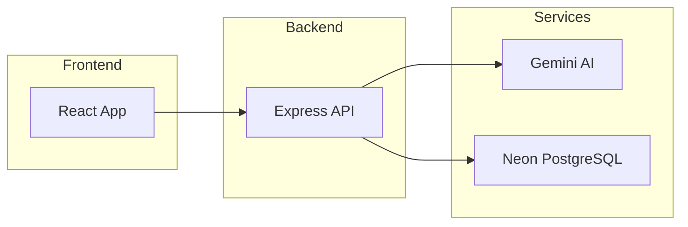
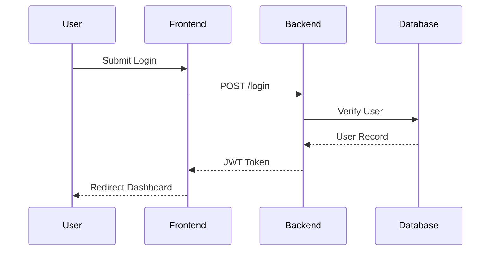
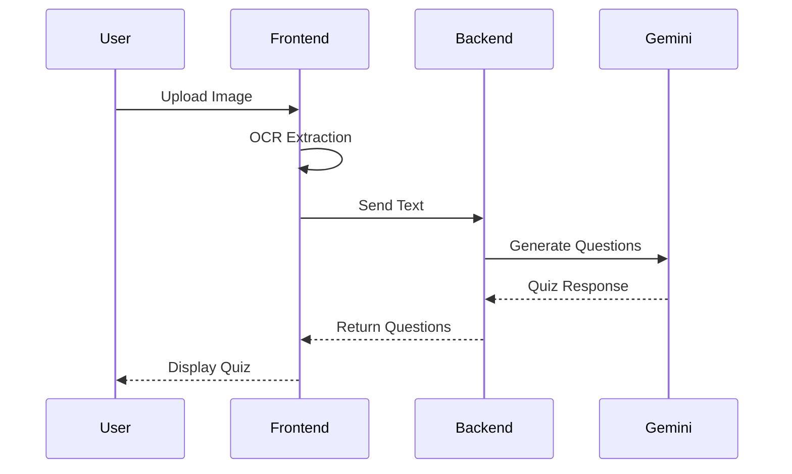
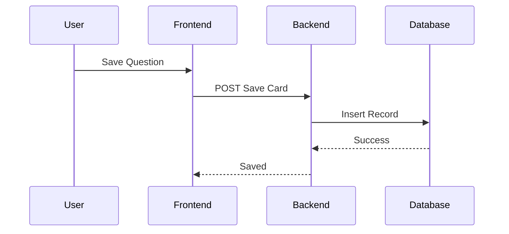
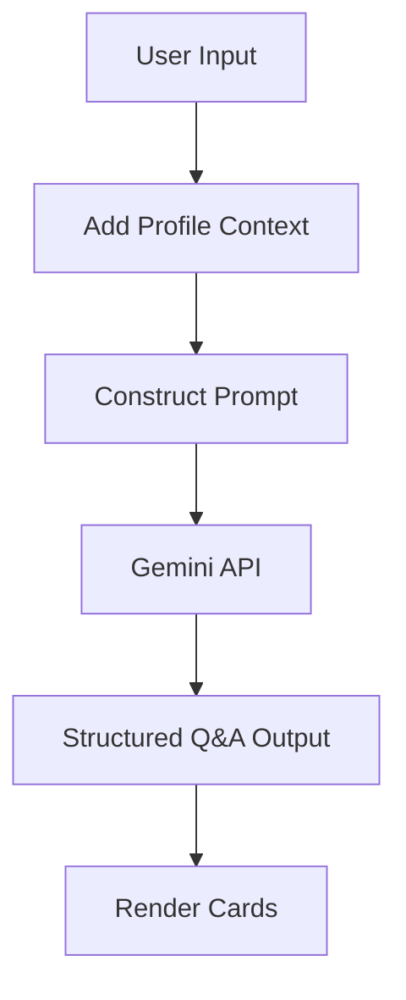
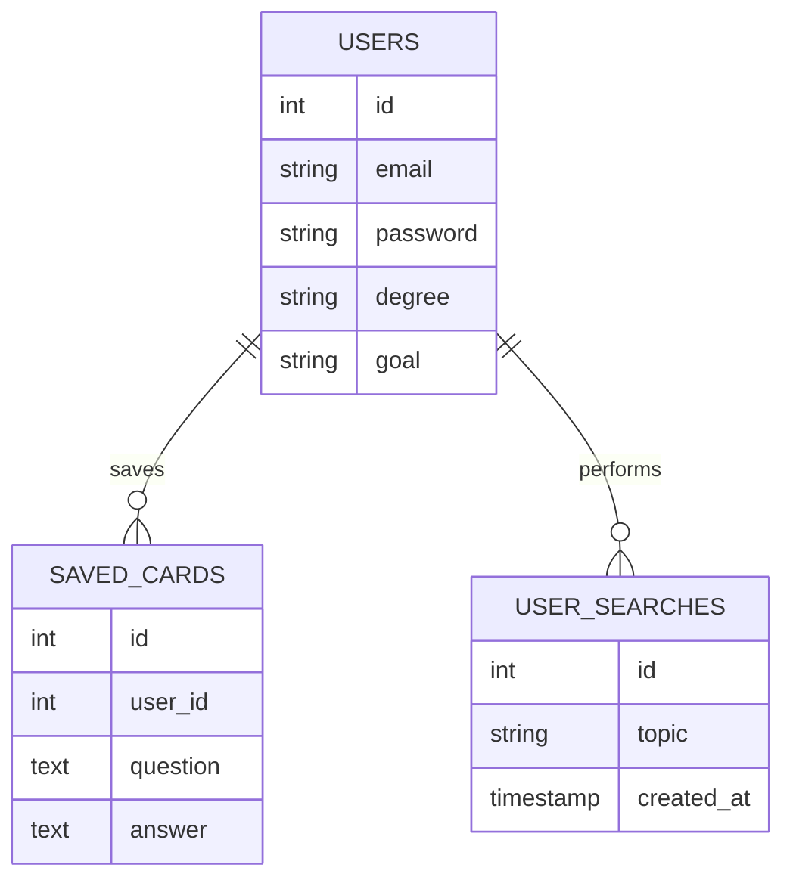
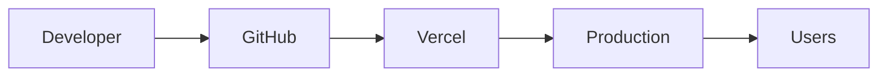
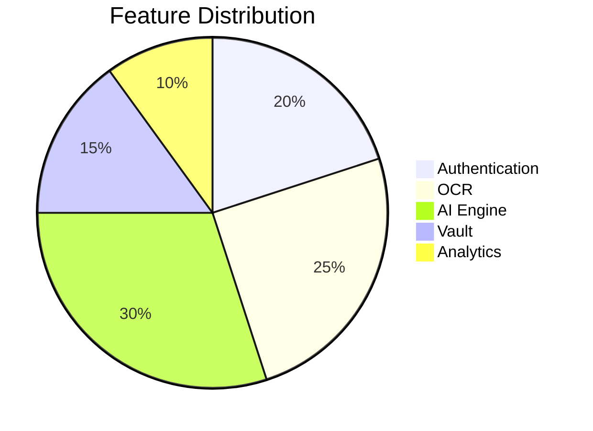

<p align="center">

</p>

<div align="center">

# StudyAI

### Intelligent Quiz Generation Platform For Personalized Learning

<p>
<a href="https://quiz-project-five-inky.vercel.app/">

</a>


</p>

<p>


</p>

**Built by Neelkamal Gupta**

</div>

---

# Table of Contents

- [Overview](#overview)
- [Live Demo](#live-demo)
- [Core Features](#core-features)
- [Feature Matrix](#feature-matrix)
- [Product Workflow](#product-workflow)
- [System Architecture](#system-architecture)
- [Authentication Flow](#authentication-flow)
- [OCR Quiz Flow](#ocr-quiz-flow)
- [Vault Save Flow](#vault-save-flow)
- [AI Prompt Pipeline](#ai-prompt-pipeline)
- [Tech Stack](#tech-stack)
- [Project Structure](#project-structure)
- [Core Pages](#core-pages)
- [Database Schema](#database-schema)
- [API Architecture](#api-architecture)
- [Installation](#installation)
- [Environment Variables](#environment-variables)
- [Deployment Pipeline](#deployment-pipeline)
- [Security Features](#security-features)
- [Performance Optimizations](#performance-optimizations)
- [GitHub Analytics](#github-analytics)
- [Roadmap](#roadmap)
- [Contribution Guide](#contribution-guide)
- [Author](#author)
- [License](#license)

---

# Overview

StudyAI is an AI powered quiz generation platform that transforms study materials into intelligent interactive question-answer sets through OCR and generative AI.

## Users Can

- Upload images of notes for OCR based quiz generation
- Enter topics manually for AI generated quizzes
- Personalize questions based on learning profile
- Save generated questions into a private Vault
- Review previously generated content
- Use adaptive AI generated study material

## Built Around

- OCR extraction
- Generative AI prompting
- Authentication and personalization
- Database persistence
- Full stack deployment
- Secure API architecture

---

# Live Demo

## Production Deployment

https://quiz-project-five-inky.vercel.app/

Repository:

https://github.com/neelkamal1969/quiz-project

---

# Core Features

| Feature | Description |
|---|---|
| OCR Quiz Generation | Convert notes into questions |
| Topic Based Quiz | Generate quizzes from prompts |
| AI Personalization | Tailored questions using user profile |
| Authentication | Secure JWT login and signup |
| Vault | Save generated questions |
| Admin Logs | Search analytics and monitoring |
| Responsive UI | Mobile and desktop optimized |

---

# Feature Matrix

| Capability | Status |
|---|---|
| User Authentication | Implemented |
| OCR via Tesseract | Implemented |
| Gemini Integration | Implemented |
| Personalized Prompts | Implemented |
| Save Questions | Implemented |
| Search Logs | Implemented |
| Admin Dashboard | Implemented |
| Vercel Deployment | Implemented |

---

# Product Workflow



---

# System Architecture



---

# Authentication Flow



---

# OCR Quiz Flow



---

# Vault Save Flow



---

# AI Prompt Pipeline



---

# Tech Stack

## Frontend

```bash
React
Vite
Tailwind CSS
React Router
Tesseract.js
```

## Backend

```bash
Node.js
Express
JWT
bcrypt
Helmet
CORS
express-validator
express-rate-limit
```

## Database

```bash
Neon PostgreSQL
```

## AI

```bash
Google Gemini API
```

## Deployment

```bash
Vercel
```

---

# Project Structure

```bash
quiz-project/
│
├── Frontend/
│   ├── public/
│   ├── src/
│   │   ├── assets/
│   │   ├── components/
│   │   ├── Pages/
│   │   ├── App.jsx
│   │   └── main.jsx
│   └── package.json
│
├── Server/
│   ├── index.js
│   ├── package.json
│   └── .env
│
└── README.md
```

---

# Core Pages

| Page | Purpose |
|---|---|
| Home | Dashboard |
| Login | Authentication |
| Signup | Registration |
| ProfileSetup | Personalization |
| PhotoToQuestions | OCR Quiz |
| ValueToQuestions | Topic Quiz |
| Vault | Saved Questions |
| AdminLogs | Search Analytics |

---

# Database Schema



---

# API Architecture

## Authentication Routes

```http
POST /signup
POST /login
POST /info
```

## Quiz Routes

```http
POST /page
POST /search/:topic
```

## Vault Routes

```http
GET /vault/:userId
POST /save-card
DELETE /vault/:cardId
```

## Admin Routes

```http
GET /admin/logs
```

---

# Installation

## Clone Repository

```bash
git clone https://github.com/neelkamal1969/quiz-project.git

cd quiz-project
```

## Backend Setup

```bash
cd Server

npm install

npm start
```

## Frontend Setup

```bash
cd Frontend

npm install

npm run dev
```

---

# Development Commands

## Frontend

```bash
npm run dev
npm run build
npm run preview
```

## Backend

```bash
npm start
npm run dev
```

---

# Environment Variables

## Backend

```env
GEMINI_API_KEY=your_key
DATABASE_URL=your_database_url
JWT_SECRET=your_secret
PORT=3000
```

## Frontend

```env
VITE_API_URL=http://localhost:3000
```

---

# Deployment Pipeline



---

# Security Features

Implemented Protections:

- JWT Authentication
- Password Hashing
- Helmet Security Headers
- Input Validation
- API Rate Limiting
- CORS Protection
- Protected Routes
- Secure Environment Variables

---

# Performance Optimizations

| Optimization | Status |
|---|---|
| Client-side OCR | Implemented |
| Prompt Optimization | Implemented |
| Server Rate Limits | Implemented |
| React State Optimization | Implemented |
| Fast Vite Bundling | Implemented |

---

# Tech Architecture Summary

| Layer | Technology |
|---|---|
| UI | React + Tailwind |
| OCR | Tesseract.js |
| API | Express |
| Auth | JWT |
| AI | Gemini |
| Database | Neon PostgreSQL |
| Deployment | Vercel |

---

# GitHub Analytics

## Contribution Stats


---

## GitHub Streak


---

## Top Languages


---

# Project Metrics



---

# Roadmap

Planned Enhancements

- Quiz scoring engine
- Adaptive difficulty
- Flashcard mode
- Leaderboards
- PDF uploads
- Voice based quizzes
- Analytics dashboard
- Unit testing
- Integration testing
- CI/CD pipelines
- Mobile application

---

# FAQ

<details>
<summary>How does OCR work?</summary>

Tesseract extracts text from uploaded study notes.

</details>

<details>
<summary>How are quizzes generated?</summary>

Gemini generates personalized questions from extracted content.

</details>

<details>
<summary>Where is data stored?</summary>

Neon PostgreSQL.

</details>

---

# Contribution Guide

```bash
Fork repository

Create branch
git checkout -b feature-name

Commit changes
git commit -m "Add feature"

Push branch
git push origin feature-name

Open Pull Request
```

---

# Project Highlights

- Full Stack Architecture
- AI Integration
- OCR Processing
- Personalized Learning
- Production Deployment
- Modern UI/UX

---

# Author

## Neelkamal Gupta

GitHub  
https://github.com/neelkamal1969

Project Repository  
https://github.com/neelkamal1969/quiz-project

Live Demo  
https://quiz-project-five-inky.vercel.app/

---

# License

Copyright © Neelkamal Gupta.

This project is shared for academic and portfolio purposes.

All rights reserved.

---

```text
StudyAI
├── Authentication
├── OCR Quiz Generator
├── Topic Based AI Quizzes
├── Personalized Learning Profiles
├── Vault System
├── Admin Analytics
└── Full Stack Deployment
```

---

<div align="center">

## Support This Project

Star the repository

Fork the project

Contribute

</div>

<p align="center">

</p>


[](https://deepwiki.com/neelkamal1969/quiz-project)
